# DO2_LinuxNetwork-1

## Part 1. Инструмент ipcalc

### 1.1. Сети и маски

- Адрес сети 192.167.38.54/13

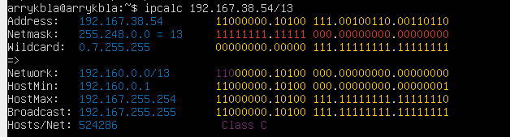

- Перевод маски 255.255.255.0 в префиксную и двоичную запись

- /15 в обычную и двоичную

- 11111111.11111111.11111111.11110000 в обычную и префиксную (К сожалению, двоичную форму адреса передать на вход ipcalc нельзя)

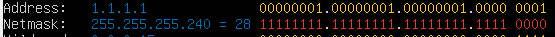

Минимальный и максимальный хост в сети 12.167.38.4 при масках:

- /8

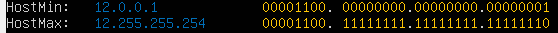

- /11111111.11111111.00000000.00000000

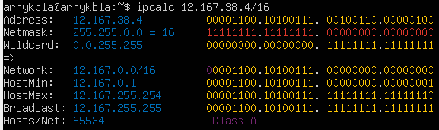

- /255.255.254.0

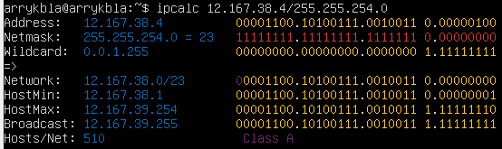

- /4

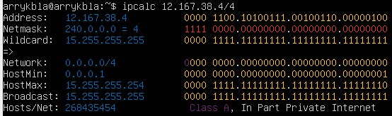

### 1.2 localhost

- 127.0.0.0 — 127.255.255.255 - диапозон localhost, значит можно использовать только 127.0.0.2 и 127.1.0.1

### 1.3. Диапазоны и сегменты сетей

- Какие из перечисленных IP можно использовать в качестве публичного, а какие только в качестве частных:
- Существует разделение IP-адресов на «частные» и «публичные». Под частные (они же локальные сети) сети зарезервированы следующие диапазоны адресов:

- 10.0.0.0 — 10.255.255.255 (10.0.0.0/8);

- 172.16.0.0 — 172.31.255.255 (172.16.0.0/12);

- 192.168.0.0 — 192.168.255.255 (192.168.0.0/16);

- 127.0.0.0 — 127.255.255.255 (зарезервировано для петлевых интерфейсов (не используется для обмена между узлами сети), т. н. localhost).

- Значит, частные: 10.0.0.45, 192.168.4.2, 172.20.250.4, 172.16.255.255, 10.10.10.10

- Публичные: 134.43.0.2, 172.0.2.1, 192.172.0.1, 172.68.0.2, 192.169.168.1

- Какие из перечисленных IP-адресов шлюза возможны у сети 10.10.0.0/18: 10.0.0.1, 10.10.0.2, 10.10.10.10, 10.10.100.1, 10.10.1.255:

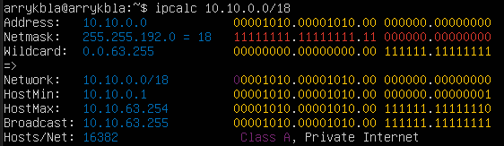

- Значит, 10.10.0.2, 10.10.10.10, 10.10.1.255

## Part 2. Статическая маршрутизация между двумя машинами

- С помощью команды ip a посмотри существующие сетевые интерфейсы

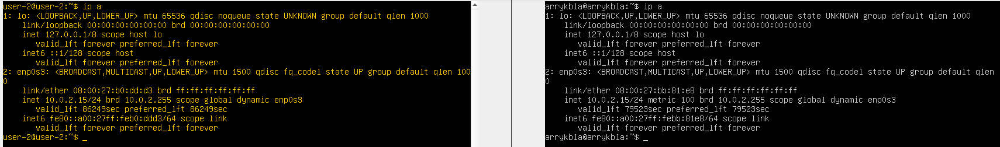

- Опиши сетевой интерфейс, соответствующий внутренней сети, на обеих машинах и задай следующие адреса и маски: ws1 — 192.168.100.10, маска /16, ws2 — 172.24.116.8, маска /12.

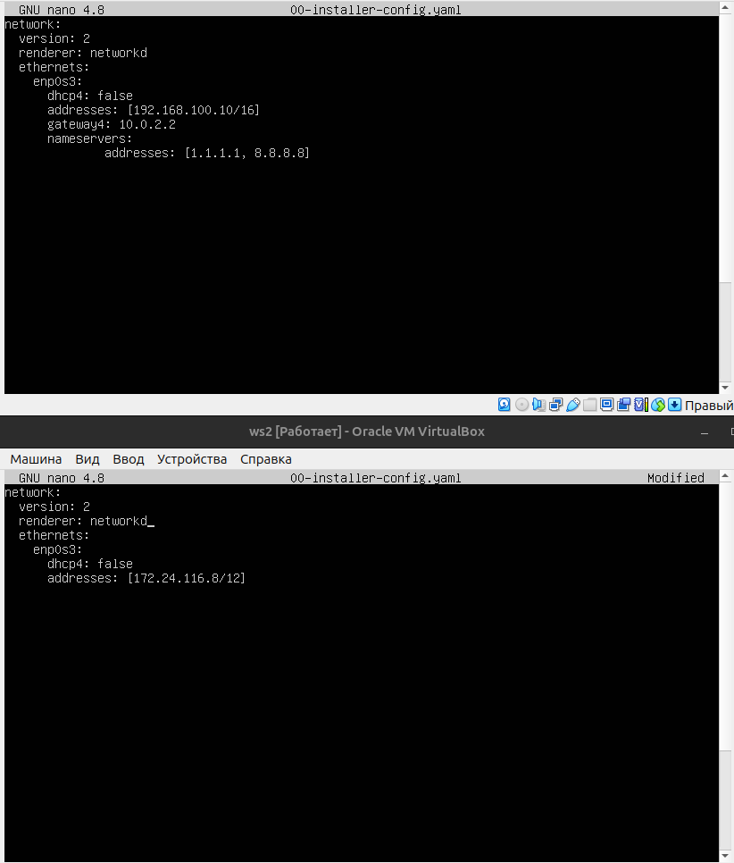

- Выполни команду netplan apply для перезапуска сервиса сети

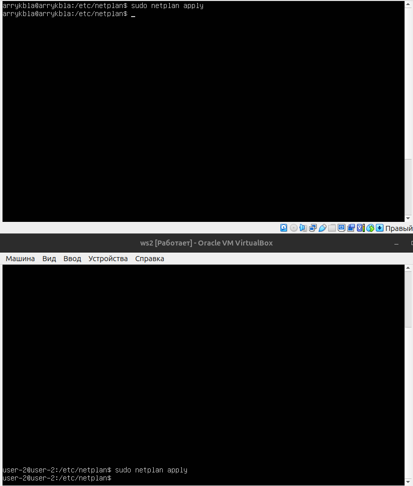

### 2.1. Добавление статического маршрута вручную

- Добавь статический маршрут от одной машины до другой и обратно при помощи команды вида ip r add.

- Пропингуй соединение между машинами

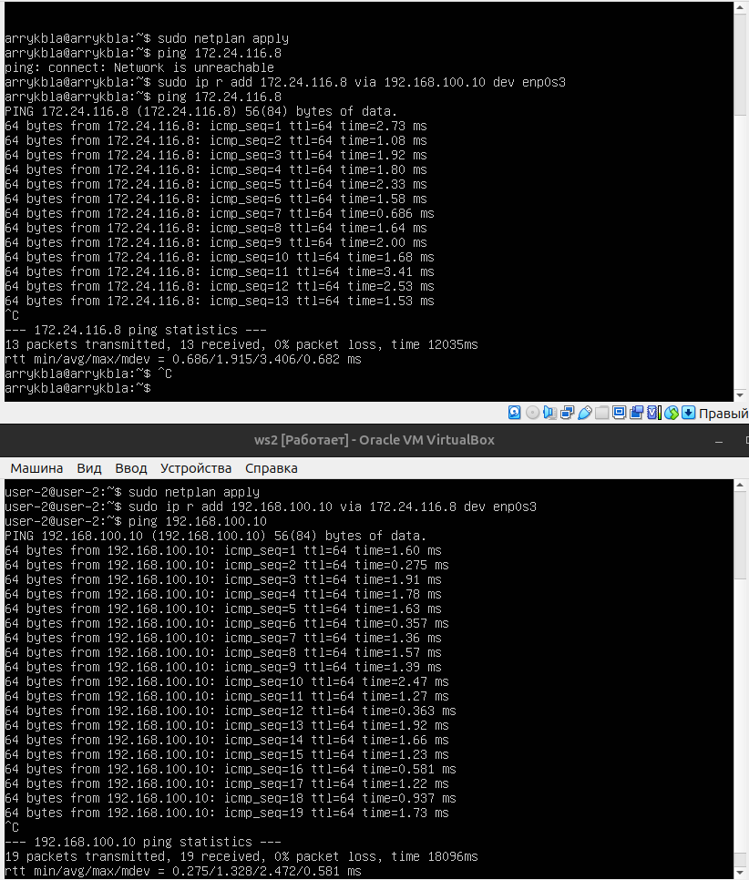

### 2.2. Добавление статического маршрута с сохранением

- Перезапусти машины: sudo reboot

- Добавь статический маршрут от одной машины до другой с помощью файла /etc/netplan/00-installer-config.yaml

- В отчёт помести скрин с содержанием изменённого файла /etc/netplan/00-installer-config.yaml

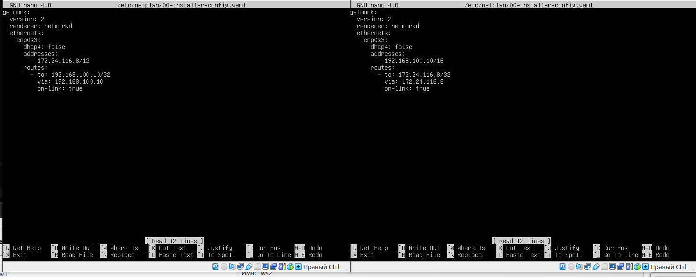

- Пропингуем соединение между машинами.

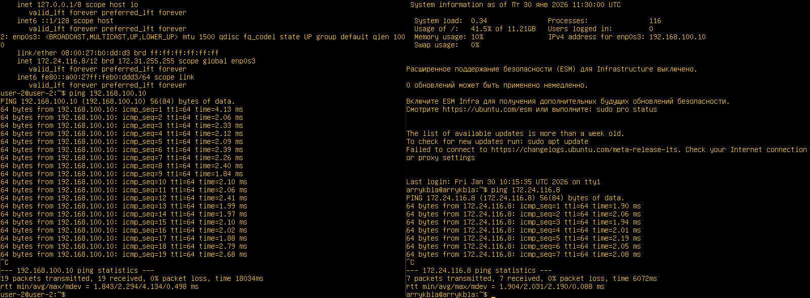

## Part 3. Утилита iperf3

### 3.1. Скорость соединения

Переведи и запиши в отчёт: 8 Mbps в MB/s, 100 MB/s в Kbps, 1 Gbps в Mbps.

8 Mbps = 1 MB/s

100 MB/s = 100000 Kbps

1 Gbps = 1000 mbps

### 3.2. Утилита iperf3

Измерь скорость соединения между ws1 и ws2.

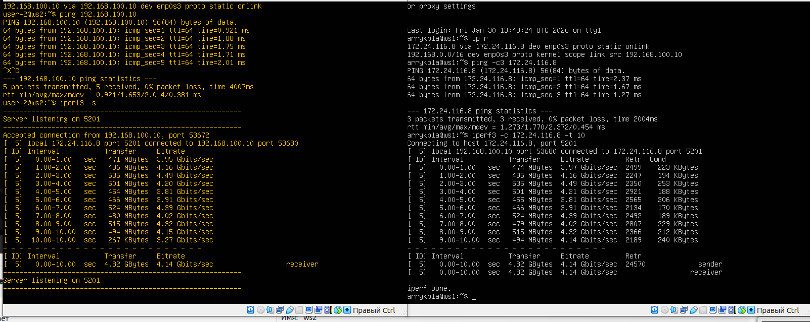

## Part 4. Сетевой экран

### 4.1. Утилита iptables

- Создай файл /etc/firewall.sh, имитирующий файрвол, на ws1 и ws2:

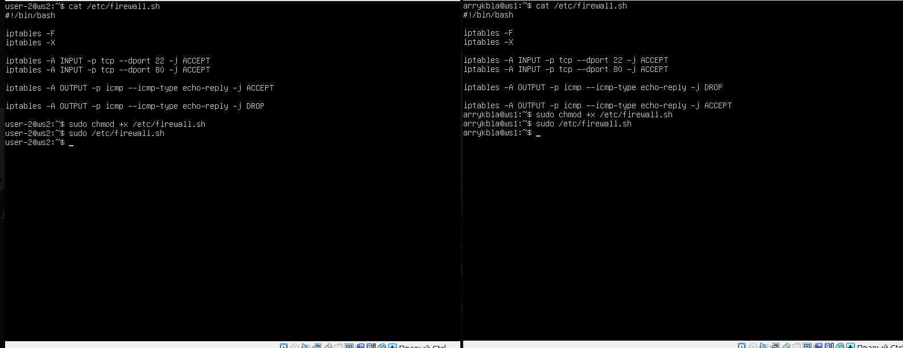

- В ws1 сперва применяется правило, которое не позволяет пинговать эту систему (потому что разрешение стоит после запрещения), а в ws2 сперва применяется правило, разрешающее пинг

### 4.2. Утилита nmap

- Командой ping найди машину, которая не «пингуется», после чего утилитой nmap покажи, что хост машины запущен

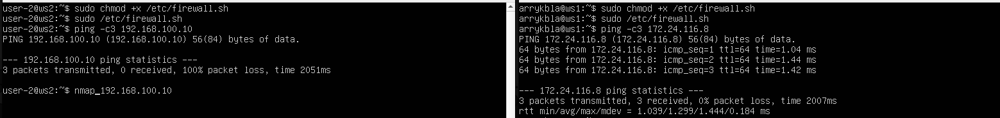

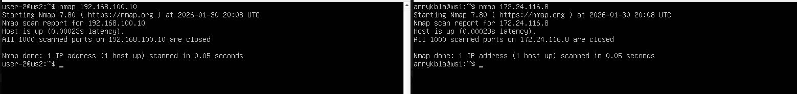

## Part 5. Статическая маршрутизация сети

## 5.1. Настройка адресов машин

- Рабочая станция ws11 настройка netplan:

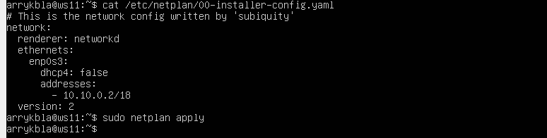

- Роутер r1 настройка netplan:

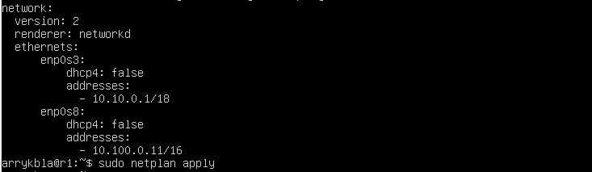

- Роутер r2 настройка netplan:

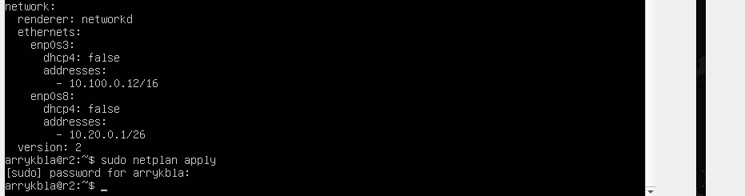

- Рабочая станция ws21 настройка netplan:

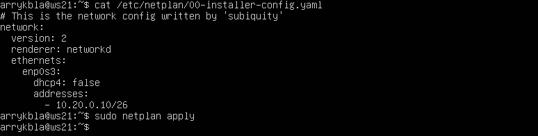

- Рабочая станция ws22 настройка netplan:

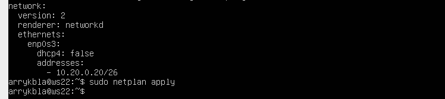

## 5.2. Включение переадресации IP-адресов

- Для включения переадресации IP выполни команду на роутерах:
- sysctl -w net.ipv4.ip_forward=1
- При таком подходе переадресация не будет работать после перезагрузки системы

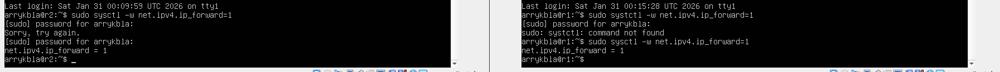

- Открываю файл /etc/sysctl.conf командой sudo nano /etc/sysctl.conf и ищу строку net.ipv4.ip_forward = 1 и раскомментирую её
убрав вначале строки знак # .

- При использовании этого подхода, IP-переадресация включена на постоянной основе.

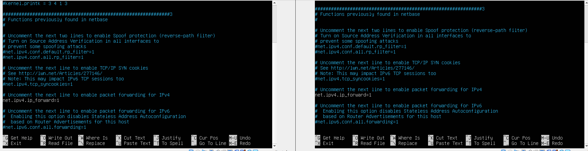

## 5.3. Установка маршрута по умолчанию

- Настрой маршрут по умолчанию (шлюз) для рабочих станций. Для этого добавь default перед IP-роутера в файле конфигураций

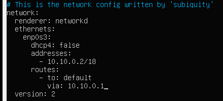

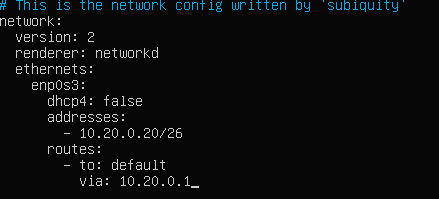

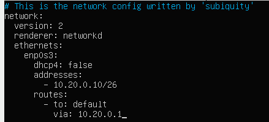

- Вызови ip r и покажи, что добавился маршрут в таблицу маршрутизации

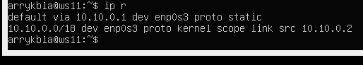

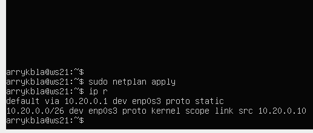

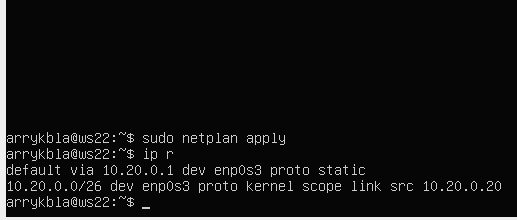

- Пропингуй с ws11 роутер r2 и покажи на r2, что пинг доходит. Для этого используй команду:

- пингуем с ws11 

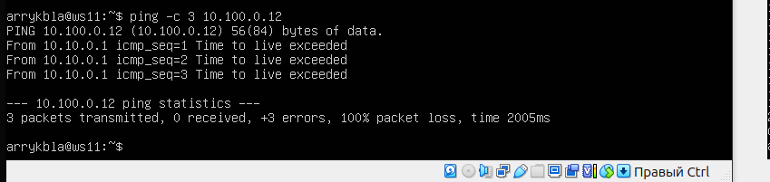

- Скрин отслеживания пакетов на роутере r2:

- sudo tcpdump -tn -i
enp0s3 icmp

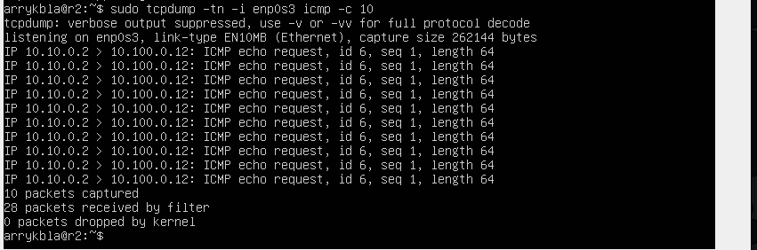

На ws11 результат пингования выглядит так что все пакеты потеряны, но это так и должно быть.
Пинг с рабочей станции ws11 до роутера r2 проходит успешно (пакеты достигают интерфейса r2), что подтверждается выводом команды
tcpdump на роутере r2. Однако в консоли ws11 мы видим 100% потерю пакетов.
Это объясняется тем, что на данном этапе настроена только прямая маршрутизация (маршрут по умолчанию на ws11), но на роутере r2
отсутствует обратный маршрут до сети 10.10.0.0/18 , из-за чего r2 не может отправить ответный пакет.

## 5.4. Добавление статических маршрутов

- Добавь в роутеры r1 и r2 статические маршруты в файле конфигураций

1. Настройка для роутера r1

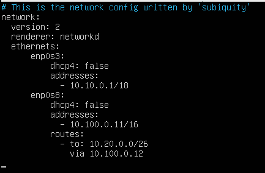

2. Настройка для роутера r2

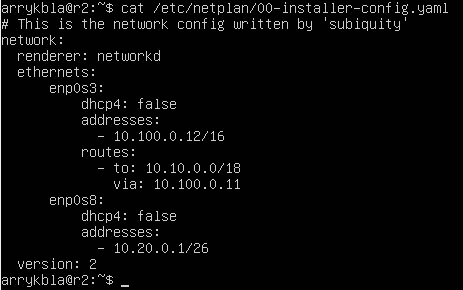

- Вызови ip r и покажи таблицы с маршрутами на обоих роутерах

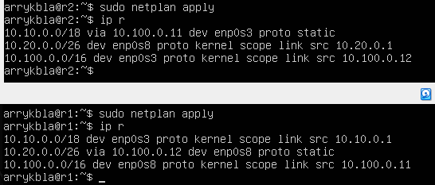

- Запусти команды на ws11:
- ip r list 10.10.0.0/[маска сети] и ip r list 0.0.0.0/0

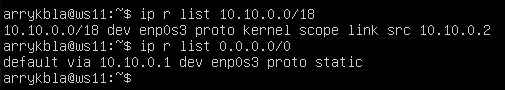

- Маршрут был выбран отличный, поскольку процесс оценки маршрута в каждом маршрутизаторе использует метод совпадения самого длинного префикса для получения наиболее точного маршрута. Сеть с самой длинной маской подсети или префиксом сети, которая соответсвует целевому ip-адресу, является сетевым шлюзом следующего перехода. Процесс повторяется до тех пор, пока пакет не будет доставлен на хост назначения. Если вкратце, при наличии двух и более маршрутов выбирается маршрут с самой длинной маской т.к. он более точный

## 5.5. Построение списка маршрутизаторов

- Запусти на r1 команду дампа:
- tcpdump -tnv -i eth0

- При помощи утилиты traceroute построй список маршрутизаторов на пути от ws11 до ws21

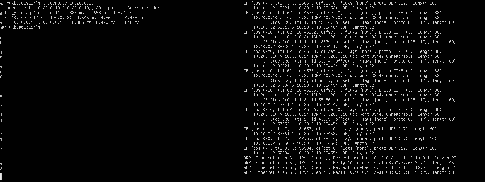

Каждый пакет проходит на своем пути определенное количество узлов, пока достигнет своей цели. Причем, каждый пакет имеет свое время жизни. Это количество узлов, которые может пройти пакет перед тем, как он будет уничтожен. Этот параметр записывается в заголовке TTL, каждый маршрутизатор, через который будет проходить пакет уменьшает его на единицу. При TTL=0 пакет уничтожается, а отправителю отсылается сообщение Time Exceeded.Команда traceroute linux использует UDP пакеты. Она отправляет пакет с TTL=1 и смотрит адрес ответившего узла, дальше TTL=2, TTL=3 и так пока не достигнет цели. Каждый раз отправляется по три пакета и для каждого из них измеряется время прохождения. Пакет отправляется на случайный порт, который, скорее всего, не занят. Когда утилита traceroute получает сообщение от целевого узла о том, что порт недоступен трассировка считается завершенной

## 5.6. Использование протокола ICMP при маршрутизации

- Запусти на r1 перехват сетевого трафика, проходящего через eth0 с помощью команды:
- tcpdump -n -i eth0 icmp

- Пропингуй с ws11 несуществующий IP (например, 10.30.0.111) с помощью команды:
- ping -c 1 10.30.0.111

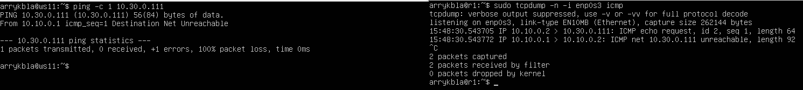

## Part 6. Динамическая настройка IP с помощью DHCP 

- Для r2 настрой в файле /etc/dhcp/dhcpd.conf конфигурацию службы DHCP:

- Укажи адрес маршрутизатора по умолчанию, DNS-сервер и адрес внутренней сети. Пример файла для r2:

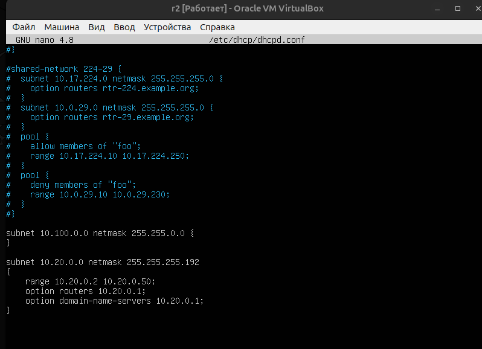

- В файле resolv.conf пропиши nameserver 8.8.8.8

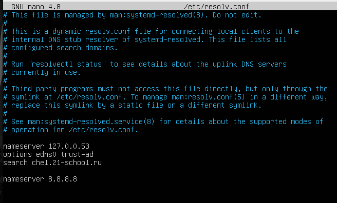

- Перезагрузи службу DHCP командой systemctl restart isc-dhcp-server. 

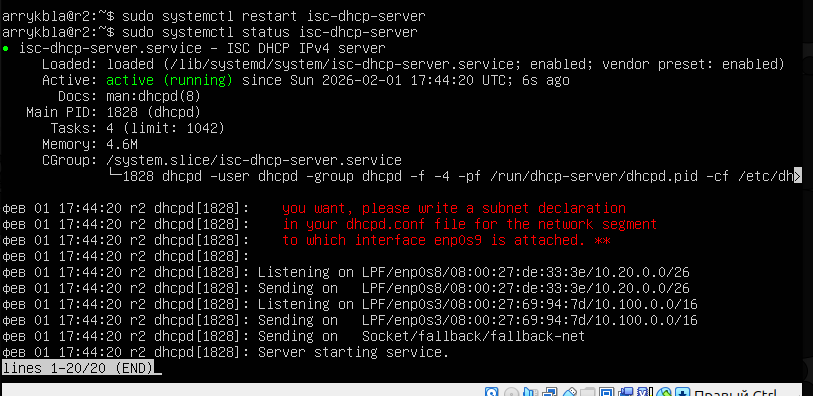

- Машину ws21 перезагрузи при помощи reboot и через ip a покажи, что она получила адрес. 

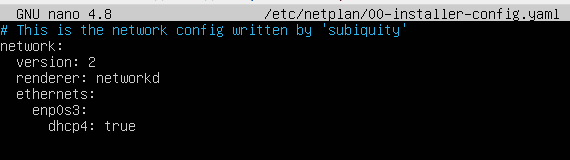

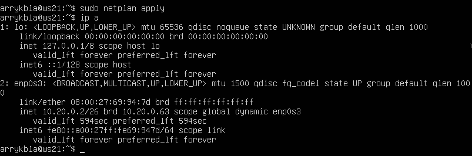

-пропингуй ws22 с ws21.

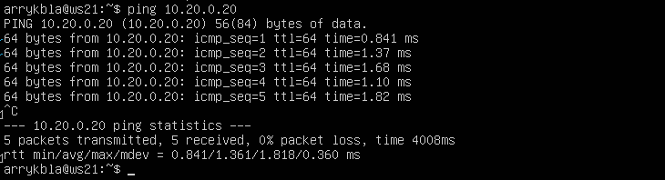

- Укажи MAC-адрес у ws11, для этого в etc/netplan/00-installer-config.yaml надо добавить строки: macaddress: 10:10:10:10:10:BA, dhcp4: true

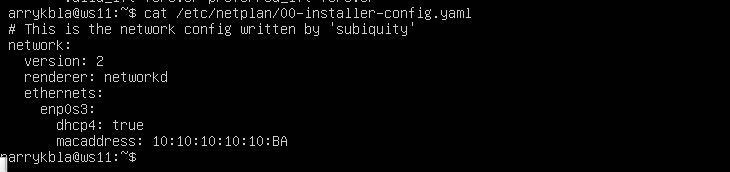

- Для r1 настроить аналогично r2, но сделать выдачу адресов с жесткой привязкой к MAC-адресу (ws11). Провести аналогичные тесты

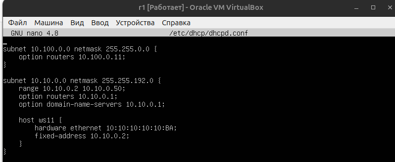

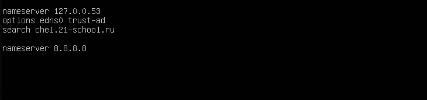

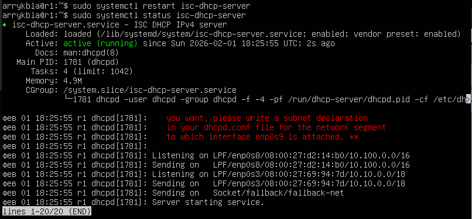

- На машине ws21 запросим обновление ip адреса, команда sudo dhclient -r освободит ip-адрес, команда sudo dhclient отправит запрос на получение нового адреса у DHCP сервера

до:

после:

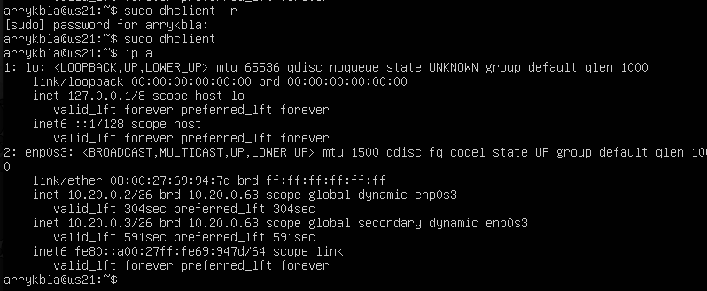

## Part 7. NAT

- В файле /etc/apache2/ports.conf на ws22 и r1 измени строку Listen 80 на Listen 0.0.0.0:80, то есть сделай сервер Apache2 общедоступным

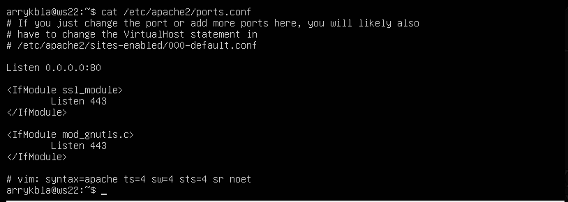

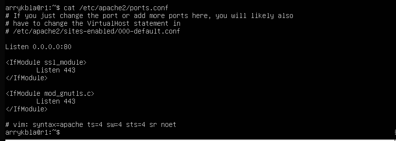

- Запусти веб-сервер Apache командой service apache2 start на ws22 и r1

- Добавь в фаервол, созданный по аналогии с фаерволом из Части 4, на r2 следующие правила:

- Удаление правил в таблице filter — iptables -F;

- Удаление правил в таблице «NAT» — iptables -F -t nat;

- Отбрасывать все маршрутизируемые пакеты — iptables --policy FORWARD DROP.

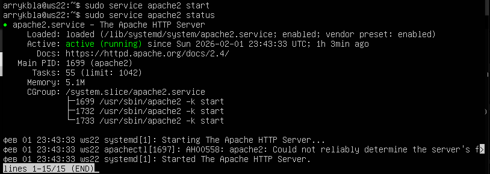

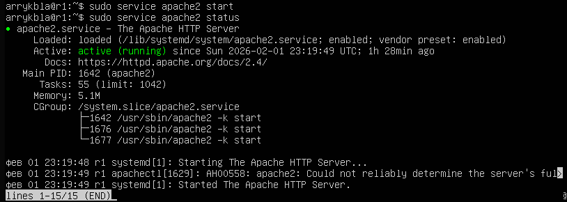
 
 - Удаление правил в таблице filter — iptables -F;

- Удаление правил в таблице «NAT» — iptables -F -t nat;

- Отбрасывать все маршрутизируемые пакеты — iptables --policy FORWARD DROP.

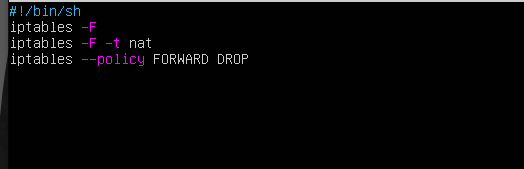

- Проверь соединение между ws22 и r1 командой ping.
- При запуске файла с этими правилами, ws22 не должна «пинговаться» с r1.

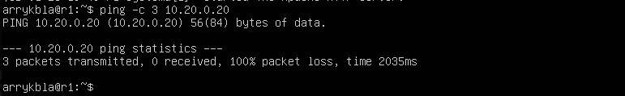

- Добавим в фаервол r2 еще одно правило, разрешающее маршрутизацию всех пакетов протокола ICMP iptables -A FORWARD -p icmp -j ACCEPT:

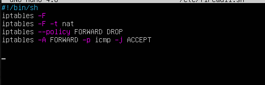

- Проверь соединение между ws22 и r1 командой ping.
- При запуске файла с этими правилами, ws22 должна «пинговаться» с r1.

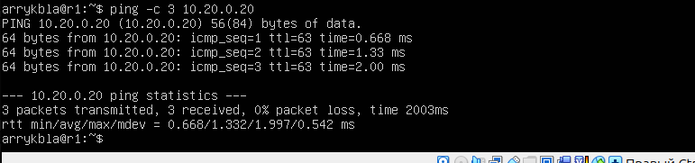

- Добавь в файл ещё два правила:
- SNAT и DNAT:

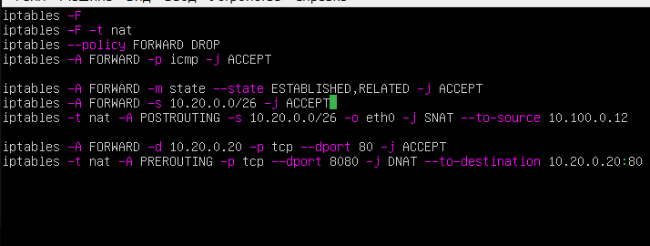

- Проверь соединение по TCP для SNAT: для этого с ws22 подключиться к серверу Apache на r1:

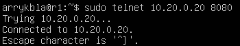

- Проверь соединение по TCP для DNAT: для этого с r1 подключиться к серверу Apache на ws22 командой telnet (обращаться по адресу r2 и порту 8080).

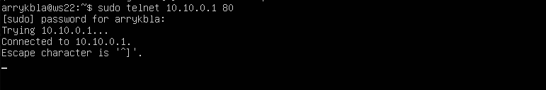